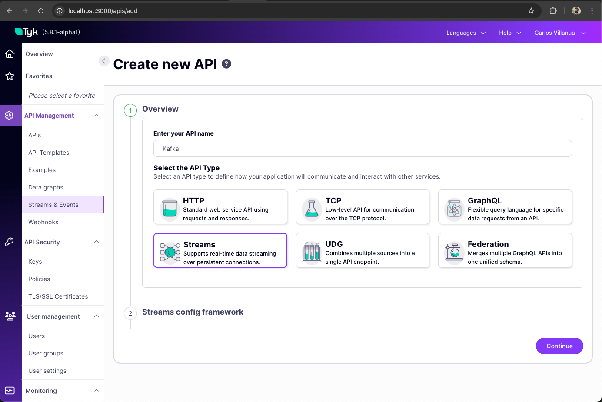
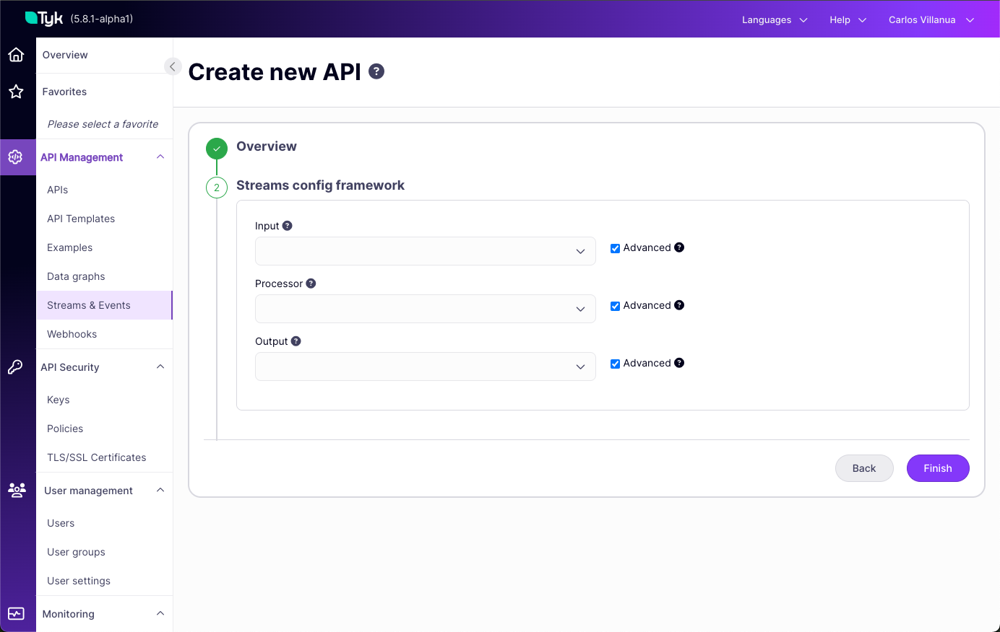

# Tyk Streams AMQP to Kafka/AMQP Demo

This repository demonstrates how to use Tyk Streams to read from an AMQP data source and forward it to both Kafka and another AMQP instance. It showcases Tyk's capabilities for real-time data streaming and transformation across different messaging protocols.


The GIF above demonstrates the core functionality of this demo: messages being emitted to one messaging system and then automatically duplicated in another system through Tyk Streams. It shows the real-time flow of data from the source to multiple destinations.

## Architecture

The demo implements a streaming pipeline with the following components:

```
┌─────────────┐     ┌───────────────┐     ┌─────────────┐
│ AMQP Source │────▶│ Tyk Streaming │────▶│ Kafka Topic │
│ (EXTERNAL)  │     │    Pipeline   │     │    (FOO)    │
└─────────────┘     └───────┬───────┘     └─────────────┘
                            │
                            ▼
                    ┌─────────────┐
                    │ AMQP Target │
                    │    (FOO)    │
                    └─────────────┘
```

- **AMQP Source**: External AMQP endpoint that publishes messages to the "EXTERNAL" address
- **Tyk Streaming Pipeline**: Processes messages and forwards them using a fan-out pattern
- **Destinations**:
  - Kafka Topic "FOO"
  - AMQP Target "FOO"

## Prerequisites

- Docker and Docker Compose
- Go 1.22+ (for running the demo application)

## Components

### Infrastructure (docker-compose.yaml)

The demo uses Docker Compose to set up the required infrastructure:

- **Kafka & Zookeeper**: Message broker for high-throughput messaging
- **RabbitMQ**: AMQP 1.0 message broker
- **Tyk Stack**: Including Tyk Dashboard, Tyk API Gateway and Tyk Pump

### Demo Application (main.go)

The Go application demonstrates:

1. Consuming messages from Kafka
2. Consuming messages from AMQP
3. Publishing messages to an external AMQP address
4. Displaying real-time status and messages via a web interface

## Setup Instructions

### 1. Start the Infrastructure

```bash
docker-compose up -d
```

This will start Kafka, Zookeeper. Tyk Dashboard, Tyk API Gateway, Tyk Pump, and RabbitMQ services.

### 2. Configure Tyk Gateway and Dashboard

#### Add API Definition

Add the API definition to your Tyk Gateway by following the manual steps below.

### 3. Run the Demo Application

```bash
go run main.go
```

The application will:
- Connect to Kafka and AMQP endpoints
- Start sending test messages to the EXTERNAL AMQP address
- Display a web interface at http://localhost:8080 showing the message flow

## How It Works

1. The demo application sends messages to the "EXTERNAL" AMQP address
2. Tyk Streams picks up these messages from the AMQP source
3. The streaming pipeline processes the messages (in this case, removing metadata)
4. Using the fan-out pattern, Tyk forwards the processed messages to:
   - Kafka topic "FOO"
   - AMQP address "FOO"
5. The demo application consumes messages from both destinations and displays them in the web UI

## Manual Steps to Add Stream Definition to Tyk

To add the Stream definition to your Tyk Gateway:

1. Access your Tyk Dashboard or API management interface
2. Create a new API using the "Streams & Events" tab under "API Management"



3. In the step "Streams config framework" select "Advanced" for "Input, Processor and Output"



4. In the API definition "Streaming" section, add the following Stream configuration, select "Gateway Status" as "Active" and "Acess" "External":


```yaml
input:
  amqp_1:
    sasl:
      mechanism: plain
      password: guest
      user: guest
    source_address: EXTERNAL
    urls:
      - amqp://localhost:5672
output:
  broker:
    outputs:
      - kafka:
          addresses:
            - 127.0.0.1:9092
          client_id: tyk_streams_producer
          max_in_flight: 1
          retry_as_batch: true
          topic: FOO
      - amqp_1:
          sasl:
            mechanism: plain
            password: guest
            user: guest
          target_address: FOO
          urls:
            - amqp://localhost:5672
    pattern: fan_out
pipeline:
  processors:
    - mapping: |
        # Remove all existing metadata from messages
        meta = deleted()
```

5. Save the API definition
6. Reload or restart your Tyk Gateway to apply the changes

## Key Features Demonstrated

- **Protocol Translation**: Converting between AMQP and Kafka protocols
- **Fan-out Pattern**: Sending the same message to multiple destinations
- **Message Transformation**: Using the mapping processor to modify messages
- **Real-time Monitoring**: Visualizing the message flow through the web interface
- **Dynamic Configuration**: Using API Definition values in stream configurations

## Advanced Features

### Dead Letter Queues

Tyk Streams (powered by the Bento engine) supports Dead Letter Queues (DLQs) for handling message processing failures. You can configure cross-protocol fallbacks to ensure message delivery even when a primary destination is unavailable.

#### Cross-Protocol Fallbacks

For Kafka with AMQP fallback:

```yaml
output:
  fallback:
    output:
      kafka:
        addresses:
          - 127.0.0.1:9092
        client_id: tyk_streams_producer
        topic: FOO
    fallbacks:
      - amqp_1:
          sasl:
            mechanism: plain
            password: guest
            user: guest
          target_address: KAFKA_DLQ
          urls:
            - amqp://localhost:5672
```

For AMQP with Kafka fallback:

```yaml
output:
  fallback:
    output:
      amqp_1:
        sasl:
          mechanism: plain
          password: guest
          user: guest
        target_address: FOO
        urls:
          - amqp://localhost:5672
    fallbacks:
      - kafka:
          addresses:
            - 127.0.0.1:9092
          client_id: tyk_streams_dlq
          topic: AMQP_DLQ
```

#### DLQ Recovery Stream

You can also define a separate stream to process messages from DLQ topics and forward them back to the original destinations when they recover:

```yaml
# DLQ Recovery Stream
streams:
  DLQ_Recovery:
    input:
      # Read from Kafka DLQ
      kafka:
        addresses:
          - 127.0.0.1:9092
        topics:
          - AMQP_DLQ
        consumer_group: dlq_recovery
    output:
      # Try to send to the original destination
      retry:
        output:
          amqp_1:
            sasl:
              mechanism: plain
              password: guest
              user: guest
            target_address: FOO
            urls:
              - amqp://localhost:5672
        base_delay: 30s
        max_delay: 5m
        max_retries: 20
```

This configuration ensures that no messages are lost even when the primary destination is unavailable, and provides a mechanism to recover and reprocess messages when systems come back online.

### Retry Mechanisms

For temporary failures, you can configure retry mechanisms instead of immediately sending to a DLQ:

```yaml
output:
  retry:
    # Required output configuration
    output:
      kafka:
        addresses:
          - 127.0.0.1:9092
        topic: FOO
    # Optional retry parameters
    base_delay: 1s
    max_delay: 5m
    max_retries: 10
```

This approach attempts to deliver messages multiple times before considering them failed.

## Dynamic Configuration with $tyk_config

Tyk Streams supports dynamic configuration using the `$tyk_config` feature. This allows you to reference values from the API Definition in your stream configuration, making it more flexible and secure.

### How It Works

You can use the `$api_config` prefix to access values defined in your API Definition. This is particularly useful for:

- Credentials (usernames, passwords)
- Connection strings
- Topic names
- Other configuration parameters

### Example: Dynamic AMQP Credentials

Instead of hardcoding credentials in your stream configuration, you can define them in the API Definition and reference them:

```yaml
input:
  amqp_1:
    sasl:
      mechanism: plain
      password: $api_config.amqp_password
      user: $api_config.amqp_user
    source_address: EXTERNAL
    urls:
      - amqp://localhost:5672
```

With this approach, you can:
1. Store sensitive credentials securely in your API Definition
2. Change credentials without modifying the stream configuration
3. Use different credentials for different environments

## Dependencies

- [go-amqp](https://github.com/Azure/go-amqp): AMQP 1.0 client for Go
- [kafka-go](https://github.com/segmentio/kafka-go): Kafka client for Go

## Documentation Resources

While AMQP is not yet mentioned as part of the official Tyk documentation, you can refer to the following resources for detailed information:

### AMQP Components
- [AMQP Input](https://warpstreamlabs.github.io/bento/docs/components/inputs/amqp_1) - Documentation for AMQP input configuration
- [AMQP Output](https://warpstreamlabs.github.io/bento/docs/components/outputs/amqp_1) - Documentation for AMQP output configuration

### Other Useful Components
- [Mapping Processor](https://warpstreamlabs.github.io/bento/docs/components/processors/mapping) - Documentation for the mapping processor used in this demo
- [Fallback Output](https://warpstreamlabs.github.io/bento/docs/components/outputs/fallback) - Documentation for implementing fallback mechanisms in outputs
- [Retry Output](https://warpstreamlabs.github.io/bento/docs/components/outputs/retry) - Documentation for configuring retry mechanisms
- [HTTP Client Output](https://warpstreamlabs.github.io/bento/docs/components/outputs/http_client) - Documentation for HTTP client output configuration

## Troubleshooting

- Ensure all services are running with `docker-compose ps`
- Check Tyk Gateway logs for any streaming errors
- Verify connection settings in both the Tyk Stream definition and the demo application
